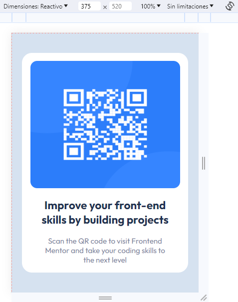

# Frontend Mentor - QR code component solution

This is a solution to the [QR code component challenge on Frontend Mentor](https://www.frontendmentor.io/challenges/qr-code-component-iux_sIO_H). Frontend Mentor challenges help you improve your coding skills by building realistic projects. 

## Table of contents

  - [Screenshot](#screenshot)
  - [Links](#links)
- [My process](#my-process)
  - [Built with](#built-with)
  - [What I learned](#what-i-learned)
- [Author](#shaggyt851)

### Screenshot

### Links

- Solution URL: [Add solution URL here](https://your-solution-url.com)
- Live Site URL: [Add live site URL here](https://your-live-site-url.com)

### Built with

- Semantic HTML5 markup
- CSS custom properties
- Flexbox
- Mobile-first workflow
- [Astro3.0](https://astro.build/blog/astro-3/) 

### What I learned

¡Estoy encantado de compartir mi experiencia con Astro 3.0! Esta herramienta ha demostrado ser fundamental para acelerar el rendimiento de mis proyectos web. Al mismo tiempo, quiero destacar la importancia de aplicar una sólida semántica en HTML y mantener un código limpio en CSS3.

La combinación de Astro 3.0 con una estructura HTML semántica no solo mejora la accesibilidad de mis sitios web, sino que también permite una mejor comprensión y mantenimiento del código. Además, la adopción de buenas prácticas de CSS3, como el uso de selectores claros y la modularización del código, ha repercutido positivamente en la escalabilidad y legibilidad de mis estilos.

En resumen, Astro 3.0 nos brinda un impulso en el rendimiento, mientras que la aplicación de una buena semántica en HTML y un código limpio en CSS3 sienta una base sólida para el éxito a largo plazo en el desarrollo web. ¡Es emocionante ver cómo estas herramientas y prácticas se combinan para elevar la calidad y eficiencia de nuestros proyectos!

## Author

- Website - [Shaggyt85](https://www.your-site.com)
- Twitter - [@shaggyt851](https://www.twitter.com/shaggyt851)
